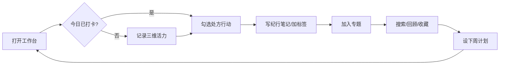

# 活力纪行 · App 丰富度升级方案

> 版本：v2 · 2026-08-29  
> 原则：**渐进式增强**，保留现有打卡/处方/回顾核心；**0 新增系统权限**  
> 状态：方案定稿 → 待实施

---

## 0. 执行前分析摘要

### 当前问题

| # | 问题 | 严重度 |
|---|------|--------|
| 1 | 核心闭环过窄：「每天点 3 个 chip + 勾处方」占主路径，深度不足 | 高 |
| 2 | Store 能力 > UI：笔记收藏/删除、笔记搜索、计划 save 已有，界面未接 | 高 |
| 3 | 二级页大量只读：成就、计划、收藏笔记、时间轴非打卡事件无详情 | 高 |
| 4 | 首页「最近动态」只切 Tab，不进对应详情 | 中 |
| 5 | 计划系统伪丰富：仅自动「本周打卡」，用户不能新建/编辑/归档 | 高 |
| 6 | 无标签/专题体系，收藏 = 高光日 + 笔记 favorite，结构弱 | 中 |
| 7 | 回顾缺「年」档；搜索缺日期区间、运动/精力、笔记全文 | 中 |
| 8 | 自定义行动只能建、不能改删分类 | 中 |
| 9 | 脚手架残留：`TodayPage` 死代码、AppSpec 仍写早起打卡/INTERNET | 低 |
| 10 | 视觉内容密度偏低：ops-tool 仅 2 张影像，栏目 Symbol+卡片为主 | 中 |

### 产品定位（重新表述）

**活力纪行** = 面向日常自我管理的 **本地活力生活工作台**：

> 用「运动 · 心情 · 精力」三维快速记录当日状态 → 获得规则处方微行动 → 在纪行笔记/时间轴中沉淀 → 通过计划与回顾看见成长。

不是「早起打卡工具」，而是 **可长期使用的个人活力档案 + 行动库 + 成长看板**。

### 现有功能（保留，不破坏）

- 三维打卡 + 编辑 + 删除确认 + 活力分
- 规则处方（≤3 条/日）勾选
- 高光日收藏（pin）
- 连续天数 + 每日箴言
- 周目标 3/5/7 + 进度条
- 12 条内置行动 + 加入今日
- 纪行笔记创建（Sheet）
- 时间轴聚合（5 类事件）
- 关键词 + 心情搜索（记录）
- 周/月图表 + 足迹详情 Overlay
- 8 枚成就 + 上月摘要
- 呼吸练习 60s
- 提醒调度、导出、主题、隐私合规
- 5 Tab：工作台 | 纪行 | 行动 | 成长 | 我的

### 缺失功能（相对商业级标准）

对照提示词 A～L，当前缺口：

| 类型 | 现状 | 目标 |
|------|------|------|
| A 首页工作台 | 有 7 段，缺「今日进度大卡片」视觉重心 | 加强进度 Hero + 快捷入口 6 项 |
| B 核心内容中心 | 纪行/行动分散，无统一「内容库」语义 | 纪行 Hub 升格：记录/笔记/行动三库 |
| C 我的收藏 | 高光日有；笔记 favorite UI 未接 | 收藏夹 + 分类 Tab + 详情 |
| D 用户创建 | 笔记/行动/打卡有；计划无 | 计划 CRUD + 笔记 CRUD + 专题 |
| E 搜索筛选 | 2 维 | +日期区间、运动/精力、笔记、状态 |
| F 计划系统 | 只读自动周计划 | 用户可建：打卡/处方/自定义 |
| G 打卡系统 | 完整 | 保留 + 打卡日历视图 |
| H 时间轴 | 有，事件点击不完整 | 全类型事件 → 对应详情 |
| I 数据统计 | 周/月有，无年 | +年回顾 + 分类环形图 |
| J 成就系统 | 8 格无详情 | 成就详情 Overlay + 解锁动效文案 |
| K 主题/专题 | 无 | **活力专题**（用户自建集合） |
| L 回顾系统 | 周/月 | +本月回顾卡 + 年度摘要 |

### 信息架构（目标）

```text
工作台（一级 · 今日指挥台）
├── 今日进度 Hero（打卡+处方+周目标合成一条进度）
├── 四格数据 + 快捷六项
├── 最近动态 → 直达详情（二级）
└── 本月洞察 / 挑战入口

纪行（一级 · 个人档案中心）
├── 时间轴（二级列表）→ 日详情 / 笔记详情 / 成就详情（三级）
├── 图表（周/月/年）（二级）
├── 收藏夹（高光 / 笔记 / 专题）（二级）→ 详情（三级）
└── 高级搜索 Overlay（二级）

行动（一级 · 微行动库）
├── 内置 catalog（二级）
├── 我的行动（二级）→ 编辑/删除 Sheet（三级）
└── 加入今日 → 回工作台联动

成长（一级 · 复盘与目标）
├── 成就墙 → 成就详情 Overlay（二级）
├── 数据概览 + 环形分布（二级）
├── 计划列表 → 新建/编辑计划 Sheet（二级）
└── 回顾：本周 / 本月 / 今年（二级）

我的（一级 · 设置）
└── 设置与隐私（二级）
```

### 新增页面 / 组件（实施清单）

| 类型 | 名称 | 说明 |
|------|------|------|
| 组件 | `NoteDetailOverlay` | 笔记 Hero + 正文 + 收藏/编辑/删除 |
| 组件 | `AchievementDetailOverlay` | 徽章详情 + 解锁条件 + 进度 |
| 组件 | `PlanEditorSheet` | 新建/编辑计划（类型/目标/周期） |
| 组件 | `AdvancedSearchSheet` | 多维筛选 |
| 组件 | `TopicEditorSheet` | 新建/编辑活力专题 |
| 组件 | `YearReviewSection` | 年热力 + 年度摘要（嵌入 ReviewPage） |
| 组件 | `CheckInCalendarStrip` | 本月打卡日历条（工作台） |
| 页面增强 | `HomeDashboardPage` | 进度 Hero、动态进详情、6 快捷 |
| 页面增强 | `JournalHubPage` | 第 4 段「专题」、搜索升级、事件全链 |
| 页面增强 | `ActionHubPage` | 行动编辑/删除、使用次数展示 |
| 页面增强 | `GrowthHubPage` | 计划 CRUD、年回顾入口 |
| 清理 | 删除 `TodayPage.ets` | 死代码 |

**不新增独立路由页**（保持 `Index` 单入口 + Tab 内 Overlay，符合现有架构）。

### 新增数据模型

```typescript
// VitalityTopic — 用户自建专题集合
class VitalityTopic {
  id: string
  title: string           // 如「恢复周」「出差记录」
  emoji: string           // 文案点缀，非功能图标
  noteIds: string[]       // 关联笔记 id
  recordKeys: string[]    // 关联打卡 dateKey
  createdAt: number
  updatedAt: number
}

// VitalityRecord 扩展（向后兼容，新字段可选）
class VitalityRecord {
  // 现有字段保留 …
  tagKeys: string[]       // 轻量标签：恢复/运动/社交/工作/旅行
}

// VitalityNote 扩展
class VitalityNote {
  // 现有字段保留 …
  tagKeys: string[]
  topicIds: string[]
}

// VitalityPlan 扩展（已有 class，补 UI）
// planType: checkin | prescription | custom
// 用户可设 title, targetValue, startKey, endKey, status

// YearReport（运行时计算，可不持久化）
class YearReport {
  year: number
  checkInDays: number
  avgScore: number
  topMood: string
  summary: string
}
```

Preferences 新增 key：`vitality_topics`、`record_tags`（可选全局标签池）。

### 视觉问题

- 首页缺「一条大进度」视觉锚点，四格与主卡并列，层次不够
- 纪行时间轴事件样式单一，缺类型色条/图标区分
- 成就墙 ??? 未解锁态 Demo 感强
- 空态不统一：部分仅灰字、无 CTA
- Tab「成长」仍用 `ai` 图标，语义不符 → 改 `chart`/`histogram` 或自定义 media

### UI 视觉方向

**关键词**：清晨活力 · 轻量 editorial · 鸿蒙原生 Symbol · 留白 + 一层材质图

| 区域 | 方向 |
|------|------|
| 色彩 | 保留品牌橙 `#FF6B35`，浅底深字；摄影 Hero 必加 scrim |
| 首页 | 大进度卡（圆环或粗进度条）+ 四格次一级 + 横向快捷 Chip |
| 卡片 | 统一 `surfaceCard` + 1px hairline + 轻 shadow，禁止彩虹色块 |
| 图表 | 柱/热力/环形均来自真实数据，空态引导首次打卡 |
| 空态 | `empty_calm.png` + 一句说明 + 主 CTA 按钮 |
| 图标 | 功能走 `AppIcon`/Symbol；标签 emoji 仅作文案点缀 |

---

## 1. 产品重新定位

**一句话**：记录每日三维活力，用处方与专题把生活串成可回顾、可计划的个人成长档案。

**给谁用**：希望轻量自我管理、不想用复杂健康 App 的普通用户。

**差异化**（相对通用打卡）：

1. 三维状态 → 规则处方（非 AI 空话）
2. 纪行笔记 + 时间轴 + 专题，形成「生活档案」
3. 周/月/年回顾均来自本地真实数据
4. 完全离线，仅提醒权限

---

## 2. 当前问题分析（详）

见 §0。补充 **50104-3.5 风险评估**：

- ✅ 已有：写操作、详情编辑、删除确认、统计、成就、导出
- ⚠️ 风险：审核员只逛首页+成就可能判「浅」
- ❌ 需补：笔记/计划/专题完整 CRUD、时间轴全链、年回顾、收藏详情

---

## 3. 新增功能列表（12 项，均有闭环）

| ID | 功能 | 用户场景 | 数据联动 |
|----|------|----------|----------|
| F1 | **今日进度 Hero** | 打开 App 即见今日完成度 | 打卡+处方+周目标 → 单条进度 |
| F2 | **笔记详情 CRUD** | 写纪行后回看、改、删、收藏 | 收藏 Tab / 时间轴 / 统计 noteCount |
| F3 | **计划 CRUD** | 设「本周运动 4 天」「本月处方 80%」 | 成长 Tab / 工作台进度 / 成就 |
| F4 | **活力专题** | 把出差周、恢复周笔记/日记录捆在一起 | 纪行第 4 段 / 搜索 / 收藏 |
| F5 | **记录标签** | 给打卡/笔记打：恢复/运动/社交/工作/旅行 | 搜索筛选 / 专题 / 统计分布 |
| F6 | **高级搜索** | 按日期区间+心情+运动+精力+高光+笔记 | 纪行结果 → 详情 |
| F7 | **时间轴全链** | 点任意事件进对应详情 | 与 DayDetail / NoteDetail 联动 |
| F8 | **首页动态直达** | 点最近一条进该日详情 | refreshToken 链 |
| F9 | **年回顾** | 年底看打卡天数、均分、主导心情 | StatsService.yearReport() |
| F10 | **成就详情** | 看解锁条件与当前进度 | evaluateAndUnlock 后刷新 |
| F11 | **行动管理** | 改分类、删自定义行动 | 行动库 / 今日处方 |
| F12 | **打卡日历条** | 一眼看本月哪些天已记录 | 工作台 / 纪行图表 |

**明确不做**（避免假丰富 / 要新权限）：

- ❌ 拍照、定位、健康传感器
- ❌ LLM 对话 / AI 参谋页
- ❌ 登录注册（本地 App，与 AppSpec 脚手架切割）
- ❌ 纯展示资讯流

---

## 4. 页面结构

### 4.1 工作台 `HomeDashboardPage`

```text
[Hero 问候 + 连续天]
[★ 今日总进度卡 — 打卡状态 + 处方 x/3 + 周目标 合成进度条/环]
[四格：总纪行 | 本月 | 处方率 | 收藏]
[主卡：未打卡 CTA / 已打卡摘要]
[打卡日历条 — 本月圆点]
[快捷：记录 | 笔记 | 计划 | 行动 | 呼吸 | 搜索]
[最近动态 — 点击 → 详情 Overlay]
[本月洞察 + 本周回顾一句]
```

### 4.2 纪行 `JournalHubPage`

四段 Chip：**时间轴 | 图表 | 收藏 | 专题**

- 时间轴：类型色条；全事件可点
- 图表：ReviewPage + 新增「年」档
- 收藏：高光日 / 收藏笔记 / 收藏行动（usageTop3）
- 专题：Topic 列表 → 详情（内含记录+笔记）

顶栏搜索 icon → `AdvancedSearchSheet`

### 4.3 行动 `ActionHubPage`

- 内置 / 我的 Tab
- 我的：编辑 Sheet（标题/提示/分类）、删除确认
- 卡片展示 usageCount

### 4.4 成长 `GrowthHubPage`

四段：**成就 | 概览 | 计划 | 回顾**

- 计划：列表 + FAB「新建计划」→ `PlanEditorSheet`
- 回顾：本周摘要 / 本月洞察 / 今年年报（切换）

### 4.5 我的 `MinePage`

- 修复「清除缓存」真清 Preferences 缓存项（optional）
- 导出扩展：records + notes + plans + topics JSON
- 撤回隐私二次确认

---

## 5. 底部导航方案

**保持 5 Tab**（已贴合产品，不机械套「探索/任务」模板）：

| Tab | 名称 | 职责 | 图标调整 |
|-----|------|------|----------|
| 0 | 工作台 | 今日指挥 + 快捷 | `home` |
| 1 | 纪行 | 档案 / 搜索 / 回顾图表 | `chart` |
| 2 | 行动 | 微行动库 | `biz` |
| 3 | 成长 | 成就 / 计划 / 年报 | `histogram`（替换 ai） |
| 4 | 我的 | 设置 | `user` |

---

## 6. 数据模型（关联图）

```text
VitalityRecord (dateKey)
  ├── tagKeys[]
  ├── pin (via pin_days)
  ├── MicroAction[] (prescription)
  └── linked in VitalityTopic.recordKeys[]

VitalityNote (id)
  ├── favorite
  ├── tagKeys[]
  ├── topicIds[]
  └── TimelineEvent type=note

VitalityPlan (id)
  ├── planType: checkin | prescription | custom
  ├── targetValue / currentValue (StatsService 回填)
  └── status: active | done | archived

VitalityTopic (id)
  ├── recordKeys[]
  └── noteIds[]

AchievementDef → AchievementState (unlocked)
TimelineEvent → 聚合以上所有写操作
```

**一次操作，多处更新**（示例）：

- 完成打卡 → 记录列表 / 时间轴 / 四格 / 周目标 / 计划进度 / 成就 / 洞察
- 收藏笔记 → 笔记详情图标 / 收藏 Tab / favoriteCount / 时间轴
- 删除记录 → 详情关闭 / 搜索 / 图表 / 专题内移除

---

## 7. 首页布局（线框）

```text
┌─────────────────────────────────────┐
│ 早上好，昵称          🔥 连续 12 天 │
│ 8月29日 周六 · 箴言…                │
├─────────────────────────────────────┤
│ 今日活力进度                        │
│ ████████░░░░  67%                   │
│ 已打卡 · 处方 2/3 · 本周 4/5        │
│              [继续完成 →]             │
├─────────────────────────────────────┤
│  128      18       76%      12      │
│ 总纪行   本月     处方率   收藏      │
├─────────────────────────────────────┤
│ ●●●○●●●●●●○●●  本月打卡日历条        │
├─────────────────────────────────────┤
│ [记录][笔记][计划][行动][呼吸][搜索]  │
├─────────────────────────────────────┤
│ 最近动态                            │
│ ○ 8/28 完成处方 3/3                 │
│ ○ 8/27 写了纪行笔记「出差恢复」      │
├─────────────────────────────────────┤
│ 本月洞察 · 呼吸入口                 │
└─────────────────────────────────────┘
```

---

## 8. UI 视觉方向

见 §0 UI 视觉方向。实施时同步：

- 补 1 张 `banner_workbench.png` 用于进度卡底图（ops-tool 仍 ≥2 张）
- 统一 `SectionHeader` 组件（标题 + 右侧「全部」）
- 各 Hub 顶部分段 Chip 样式与成长/纪行一致

---

## 9. 用户使用闭环



**新用户首日**：空态引导 → 首次打卡 → 解锁首成就 → 洞察文案变化  
**老用户**：专题沉淀 + 年报 + 计划完成 + 成就墙填满

---

## 10. 华为 3.5 合规检查

| 条款 | 对策 |
|------|------|
| 3.5 实质价值 | 非纯展示：打卡+处方+笔记+计划+回顾全链 |
| 3.5 创意 | 三维活力分 + 规则处方 + 专题档案，非系统日历/计算器复刻 |
| 3.2 功能完整 | 无「即将上线」；空态有 CTA；删除二次确认 |
| 3.2 无测试假数据 | 本地 App，新用户列表为空 |
| 隐私 | 协议在设置；撤回有确认+Toast；无独立隐私首屏 |
| 权限 | 仍仅 `PUBLISH_AGENT_REMINDER` |
| 差异化 | 与同仓库早起/日记 App 区分：三维+处方+专题 |

---

## 11. 开发执行顺序（代码阶段）

1. **数据层**：Topic 模型 + Store CRUD；Record/Note tagKeys；Plan 类型扩展；StatsService.yearReport  
2. **组件层**：NoteDetailOverlay、AchievementDetailOverlay、PlanEditorSheet、AdvancedSearchSheet、TopicEditorSheet  
3. **工作台**：进度 Hero、日历条、动态直达、6 快捷  
4. **纪行**：四段 + 搜索升级 + 时间轴全链  
5. **行动**：编辑/删除 + usage 展示  
6. **成长**：计划 CRUD + 年回顾 + 成就详情  
7. **我的**：导出扩展、清除缓存、撤回确认  
8. **清理**：删 TodayPage、对齐 AppSpec/feature-list、改 Tab 图标  
9. **验收**：gate:behavior + assembleHap + 手动 8 条用例  

---

## 12. 验收用例（≥8）

1. 新用户 → 空态 → 首次打卡 → 四格/进度/成就同时更新  
2. 写笔记 → 收藏 → 纪行收藏 Tab 可见 → 点进 NoteDetail → 取消收藏  
3. 新建专题 → 添加笔记与打卡日 → 专题详情列表正确  
4. 新建「本月处方 80%」计划 → 勾处方 → 计划进度更新  
5. 高级搜索：日期区间 + 心情 → 结果进 DayDetail  
6. 时间轴点「笔记事件」→ NoteDetail；点「成就」→ AchievementDetail  
7. 首页最近动态 → 直达对应日详情  
8. 年回顾：有数据时显示天数/均分/摘要；无数据空态  
9. 自定义行动：编辑分类 → 删除 → 列表刷新  
10. 导出 JSON 含 notes/plans/topics  

---

## 13. 与现有代码映射

| 已有文件 | 升级方式 |
|----------|----------|
| `VitalityStore.ets` | +topics、+deletePlan、+deleteUserAction、tag 读写 |
| `SearchService.ets` | 接 searchNotes、+filterByTags、+dateRange |
| `TimelineService.ets` | +topic 事件、点击 payload |
| `HomeDashboardPage.ets` | 进度 Hero、日历、动态 id 传递 |
| `JournalHubPage.ets` | +专题段、AdvancedSearch |
| `GrowthHubPage.ets` | PlanEditor、年回顾 |
| `ReviewPage.ets` | +ReviewMode.Year |
| `WorkbenchComponents.ets` | +ProgressHeroCard、CalendarStrip |

---

**下一步**：按 §11 顺序开始实施。每完成一层跑 `assembleHap` + `gate:behavior`。
